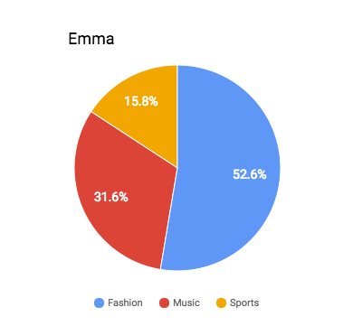
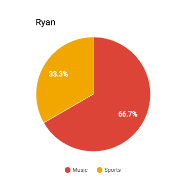
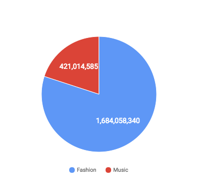

**Kin Rewards Engine RFC**
**DRAFT, VERSION 1.0**

# Overview

As laid out in the [Kin white 
paper](https://kin.kik.com/papers/Kin_Whitepaper_V1_English.pdf), the goal of 
the Kin cryptocurrency is to create an alternative ecosystem of digital 
services that is compelling for consumers, and is fair and open for developers. 
To achieve this goal, Kin needs to economically align a large group of 
partners, developers, and users to work together to form an ecosystem. 

This document proposes a technical implementation for the Kin Rewards Engine 
using cryptographic tokens to create economic incentives for participants, 
allowing them to integrate with the Kin cryptocurrency and ecosystem. Below, we 
explain how to navigate the implementation in a way that is resistant to the 
abuse and economic vulnerabilities inherent in a decentralized network context. 
This is a starting point of a productive discussion with the blockchain 
community, and feedback and comments are welcome. We are also working with 
research and advisory teams to propose alternative models and improve on this 
one. To join the discussion, visit the Kin Foundation [#technology channel on 
Telegram](https://t.me/kintechnology), or our subreddit at 
[/r/KinFoundation](https://www.reddit.com/r/KinFoundation/).

This document is the first in a series of request for comment (RFC) documents 
planned for Kin.  

After releasing an RFC on each of these subjects, feedback will be collected 
from the community of Kin enthusiasts and integrated into a technical paper 
that will complete the final implementation plan for Kin.

[[TOC]]

# The participants

The definition of the Kin Rewards Engine mainly focuses on the behavior and 
incentives of three archetypes of actors in the Kin economy: users, 
capitalists, and digital service developers.

## Users

Users adopt digital services for their day-to-day utility. When users join a 
digital service such as a messaging or social media application, they both 
provide and receive value within the service. Examples include receiving advice 
in a fashion app, hosting or joining a clan in an online video game, or hosting 
or joining a themed group chat in a messaging application. The Kin Ecosystem 
will facilitate fair compensation to users for the value they bring into the 
digital economy. The more digital services exist where users can exchange 
value, and the more value they exchange in each of those services, the larger 
and more valuable the overall Kin Ecosystem and economy becomes. 

## Capitalists

Capitalists are individuals with significant holdings of Kin, used primarily 
for investment purposes. They constitute a minority of participants in the 
ecosystem. Their main interest is to realize a return by selling Kin on 
secondary markets. Capitalists are an important aspect of the Kin economy 
because they facilitate wide distribution of the currency, liquidity to its 
markets, and – as early investors – are generally aligned with Kin for its 
long-term success.

## Digital service developers

Developers are individuals or companies that create digital services and 
applications for consumers in verticals such as fashion, gaming, live video 
streaming, photo sharing, and many more. For the Kin Ecosystem to thrive, 
developers should have incentives to constantly innovate and improve their 
products, making them more useful, enjoyable, and valuable to users and 
customers.

The main purpose of the Rewards Engine is to economically incentivize digital 
service developers to create valuable digital services for users in the Kin 
Ecosystem. This allows them to make a fair return based on the number of users 
of their services.

# The Kin Rewards Engine formula

In general, the Kin Rewards Engine will issue a daily reward to developers 
based on a measure of the Kin economy inside of each digital service. 

Let  *i* be a digital service eligible for rewards and *Ri* be the 
daily reward it will receive on a particular day. Then:

 *Ri* = *TDR* ⋅ *SSEi* ∕ *TSE*

where  *TDR* stands for "Total Daily Reward,"  *SSE* for Size of Service 
Economy,  *TSE* for Total Size of Economy. The calculations for these variables 
are described below.

##  *TDR* - Total Daily Reward

When launched, sixty percent of all Kin that will ever exist, or six trillion 
Kin, was put into the reserves of the Kin Foundation. Each day, once the 
Rewards Engine is up and running,   *d=0.061%* of the remaining 
reserves will be put into circulation (for a total of 20 percent of remaining 
reserves every year). Of these newly issued Kin, three-fourths will be 
allocated as rewards and the remaining one-fourth as a marketing and operations 
budget for the Kin Foundation. 

Kik is expected to be the largest digital service in its ecosystem. Kik is 
committed to Kin and wants Kin to thrive and to promote its adoption by digital 
services. To enable this goal, Kik will opt out of participation in the rewards 
mechanism for no less than 12 months from time of the Rewards Engine launch, 
passing it on to 3rd party developers of Kik bots.

### Formulae and calculations

Let  *Rn* be the Kin Foundation reserve on day *n*;

 *R0* = *6,000,000,000,000*

Let  *Vn* be the amount vested on day *n*:

  *Vn* = *Rn ⋅ d*

  *Rn* = *Rn-1 ⋅ (1-d)* = *R0 ⋅ (1-d)n*

For example, let’s assume the first day of Kin Rewards Engine is January 1, 
2018, and calculate the rewards on March 12, 2019:

* March 12, 2019 is the 435th day of the Kin Rewards Engine.

* Kin in reserve is *R435* = *R0 ⋅ (1-d)435* = 
*4,601,252,295,287*

* Kin that vests on March 12, 2019 is  *V435* = *R435 ⋅ 
d* = *2,806,763,900*

* Rewards on March 12, 2019 totals to *2,806,763,900 ⋅ ¾* = *2,105,072,925*

If, for example, the exchange rate for Kin was $0.000185 on March 12th, 2019, for 
a total market cap of $1 billion (active circulation = *10,000,000,000,000 - 
R435* ≅ *5.41012*), the total daily reward on March 12, 2019, would 
be equivalent to $389,828.

##  *SSEi*: Size of an economy of a single digital service

The goal of the Kin Ecosystem is to create a vibrant and growing ecosystem of 
digital services where consumers can go to earn and spend Kin in ways they find 
valuable. To evaluate the contribution of each digital service to the overall 
Kin Ecosystem, we propose finding an algorithm that reasonably measures the 
"size" of each economy, using a simple but secure methodology that reduces the 
potential for abuse and gaming.

For example, a simple measure of the amount of economic activity within a 
digital service could be the total number of transactions that occur in it over 
the course of a day. However, this algorithm is immediately vulnerable to 
attacks. Since Kin can virtually change hands thousands of times in 24 hours, 
it is easy for an attacker to artificially inflate the number of transactions 
in a particular digital service.

Another simple measure could be the amount of Kin held by all the users of each 
digital service ("sum of stake"). This measure is much more costly to inflate 
as long as users are mapped in a one-to-one fashion to a service so that no 
user’s stake is counted more than once. However, this measure does not take 
into account economic activity within a digital service, which is what the 
system would like to encourage and incentivize.

Consequently, a hybrid measure is proposed: Each user is attributed to a single 
service in which she transacted while the Rewards Engine rewards services in 
proportion to the total stake of their users. Like the sum of stake, this 
method is hard to attack from a transaction volume perspective, yet it also 
takes into account the economic activity within each service. 

In cases where a user makes transactions in more than one digital service, 
their stake will be credited for the service in which their transaction value 
was greatest (their "most preferred service"). In case of a draw between 
several services, one will be selected at random.

##  *TSE*: Overall size of the Kin ecosystem

The measure for the size of the entire Kin economy is defined to be the sum of 
economies of all digital services, or, equivalently, the sum of the stake of 
all users that participated in Kin transactions over the course of the day.

## Putting it all together

Consider the following simplified case, in which the entire Kin ecosystem has 
only three active users (Emma, Ryan, and Kaitlyn) and only three digital 
services ("Fashion," a photo pinning app developed by Ethan; “Music,” a 
streaming music service developed by Madison; and “Sports,” a sports forum 
developed by Daniel).

Ethan, the developer of the "Fashion" digital service, wants to know how much 
daily reward to expect on March 12, 2019.

Kin balance at the start of March 12, 2019:

<table>
  <tr>
    <td>Emma</td>
    <td>610</td>
  </tr>
  <tr>
    <td>Ryan</td>
    <td>190</td>
  </tr>
  <tr>
    <td>Kaitlyn</td>
    <td>10,000</td>
  </tr>
  <tr>
    <td>Ethan</td>
    <td>200</td>
  </tr>
  <tr>
    <td>Madison</td>
    <td>250</td>
  </tr>
  <tr>
    <td>Daniel</td>
    <td>600</td>
  </tr>
</table>

On March 12, 2019, users made the following transactions under the labeled 
digital services:

<table>
  <tr>
    <td>“Fashion”</td>
    <td>“Music”</td>
    <td>“Sports”</td>
  </tr>
  <tr>
    <td>Emma paid Ethan 100 kin for Fashion Advice.</td>
    <td>Emma paid Ryan 50 kin for songs he created.</td>
    <td>Ryan paid 30 kin to Emma to read her premium post. </td>
  </tr>
  <tr>
    <td></td>
    <td>Ryan paid Emma 10 kin to subscribe to her radio channel.</td>
    <td></td>
  </tr>
</table>

* Kaitlyn did not make any transactions on that day.

The association of users to their "most preferred service of the day" would be 
calculated in the following way:

* Emma will be associated with the "Fashion" digital service.
(since her spending 100 kin in “Fashion” > her earning 60 kin in “Music”  > her 
earning 30 kin in “Sports”).

* Ryan will be associated with the “Music” digital service
(since his spending 60 kin in “Music” > his spending 30 kin in “Sports”).

* Kaitlyn is not associated with any service (since she made no transactions).

* Ethan will be associated with “Fashion” (since he earned 100 kin in 
“Fashion”), even though he is the developer of this service.

 

Kin balance at the end of the day:

<table>
  <tr>
    <td>Emma</td>
    <td>500</td>
  </tr>
  <tr>
    <td>Ryan</td>
    <td>200</td>
  </tr>
  <tr>
    <td>Kaitlyn</td>
    <td>10,000</td>
  </tr>
  <tr>
    <td>Ethan</td>
    <td>300</td>
  </tr>
  <tr>
    <td>Madison</td>
    <td>250</td>
  </tr>
  <tr>
    <td>Daniel</td>
    <td>600</td>
  </tr>
</table>

As calculated in the previous section, the total reward on day 435 is 
2,105,072,925 kin. Let us assume Kin has a total market capitalization of $1 
billion. This reward is equivalent to $389,828. Then:

* **Total economy**: The size of the entire ecosystem is calculated as the 
total sum of stake held by users who participated in transactions that day: 
1,000 kin (Emma, Ryan and Ethan). 

* **Fashion**: This service will receive 80 percent (800/1000) of the Daily 
Reward, or 1,684,058,340 kin, because the stake held by its associated users 
(Emma and Ethan) sums to 800 kin. The value of this reward  is equivalent to 
$311,862.

* **Music:** This service will get the remaining 20 percent (200/1000) of the 
Daily Reward, or 421,014,585 kin. The value of this reward is equivalent to 
$77,965.

# Model analysis: incentivized behaviors

Rewards are distributed among digital service developers to directly 
incentivize the following behaviors:

* To promote economic activity within their service, as only users that were 
involved in Kin transactions in that digital service will be counted towards 
the service’s payout at the end of that reward period.

* To promote the growth of the value of transactions initiated by their users. 
Since members of multiple digital services become associated with the service 
in which the largest share of their transaction volumes took place, developers 
compete on facilitating the largest share for each user.

* To innovate forms of micropayments and recurring transactions. The rewards 
are proportional to the holdings held by users, but only take into account 
users who transacted in the 24 hour rewards period prior to the reward 
allocation. From the digital service provider’s perspective, a user who made no 
transactions in a given period of time can be seen as ripe low-hanging fruit.

# Rewards Engine vulnerability analysis

Below are some of the possible attack vectors that were considered.

## Creating large volumes of fake transactions

Transaction volume only affects the choice of a user’s most preferred digital 
service, when he was active in more than one service. Users who want to 
deliberately manipulate the choice of their "most preferred service" can do 
this by sending one large transaction daily. Generating a large volume of fake 
transactions will not provide any advantage.

## Creating fake users

Creating a large number of fake user accounts will not provide any voting 
advantage to an attacker, as the availability of accounts does not itself 
increase stake. 

## Creating large numbers of fake digital services

Creating a large number of fake digital services and generating fake 
transactions inside each one will not provide significant advantage, since 
every user may only vote for a single digital service each 24 hour period.

## Capitalists voting for themselves

A trivial method for a holder of large stake of Kin is triggering large 
transactions to herself, directly or indirectly, and associating them with a 
digital service she owns. Her service would gain rewards in proportion to her 
stake’s size relative to the entire economy, even though it may not have 
contributed an exchange of goods and services to the economy. Such behavior 
will be referred to as self-voting.

Note that even when such an scheme is attempted, it may not be an "attack" on 
the system because (1) nobody in the ecosystem is harmed by this behavior, and 
(2) there is no theoretical return on such scheme, beyond aversion of loss. 
Note that each reward payout event is an inflationary event, in the sense that 
it increases the supply of Kin without corresponding increase in demand, 
causing a momentary devaluation of all Kin in circulation. Capitalists voting 
for themselves are merely offsetting the effect of this inflation rather than 
making real returns.

Although there are means that can be applied to prevent capitalists from 
self-voting, indirect manipulations (such as revenue sharing with mainstream 
services) cannot be entirely eliminated. It is reasonable to assume that 
capitalists are sophisticated and self-serving, and that they will attempt such 
manipulations.

Given the possibility of such manipulation, the impact of manipulation must be 
analyzed to determine whether it will be below an acceptable threshold. There 
are two ways these manipulations undermine the effectiveness of the Rewards 
Engine and could prevent it from achieving its goals: 

1. Self-voting may skew the allocation of the rewards, effectively skewing 
target incentives of the system.

2. Self-voting dilutes the rewards for legitimate participants.

Skewing of incentives can be prevented by organizational oversight. The Kin 
Foundation will be vetting participating services and should bar infringing 
services. On the other hand, it should allow services that share the entirety 
of the rewards with its users in proportion to each user’s contribution. This 
will channel capitalists to use specialized anti-inflation tools and keep them 
away from dealing with real services, possibly skewing their incentives. (Read 
more on suggested terms for eligible services in [Appendix 
C](#c-subjecting-reward-eligibility-to-acceptance-of-foundation-terms).)

Dilution of the rewards will occur but needs to be controlled so as not to 
shrink the rewards given to legitimate digital services. The key is in the 
balance between Kin stake held by capitalists to that held by users: assuming 
all capitalists and all users make transactions every day, the reward will be 
divided among them in proportion to their stake.

A state in which the majority of rewards go to capitalists’ self-voting is one 
where the majority of Kin is held by capitalists. Capitalists create demand for 
Kin when their expectation is for its value to increase. Beyond short-term 
trends, such expectation can only be related to expected growth of the economy 
(via growth in user-base, in frequency of transactions and/or in value of 
transactions). But, all factors creating the expectation for growth are 
impacted by scarcity of Kin. In the long run, if most Kin is held by 
capitalists, they should expect decreased growth, pushing some capitalists to 
sell their Kin until the system re-balances with fewer capitalists and more Kin 
held by users. Further discussion about the balance between capitalists and 
non-capitalists is available in 
[Appendix B](#b-balance-between-capitalists-and-regular-users).

## Digital service developers voting for themselves

This potential problem becomes more noticeable as more Kin finds its way into 
the hands of digital service developers. Can this grow out of check? Will most 
Kin be held ultimately by digital service developers? 

This is a special case of [capitalists voting for 
themselves](#capitalists-voting-for-themselves). In addition to the threats discussed 
above, when digital services developers act as capitalists, another type of 
damage is caused to the ecosystem: under-investment in the development of 
digital services.

If there is sufficient competition between digital services, services that will 
not be investing their capital in further improvements are bound to be left 
behind. 

If there exists a dominant service that is not threatened by competition, 
holding on to most Kin would slow down the economy, resulting in devaluation of 
the currency; the dominant service suffers the greatest damage for such 
devaluation. This serves as a disincentive against such behavior.

## Users voting for themselves

If all users behave like capitalists and vote for themselves, the required 
balance between capitalists and users will not be maintained, possibly 
resulting in dilution of the effect of the rewards.

Most likely, for the average user this will not be worth the effort. Reward is 
proportional to user holdings and the vast majority of users will own 
relatively small amounts. The effective gains from this action will normally 
not justify the risk of giving a stranger access to one’s wallet.

This problem could become worse if a digital service is created whose prime 
purpose is to provide this service in an automatic and simple way. This can be 
mitigated by a vetting process of digital services applying to participate in 
the rewards; the Kin Foundation should require all such services to adhere to a 
set of rules, preventing such behavior. Such mechanism is discussed in 
[Appendix C](#c-subjecting-reward-eligibility-to-acceptance-of-foundation-terms).

# Conclusion

The goal of the Kin Rewards Engine is to economically align a large group of 
developers to work together to build an alternative ecosystem of digital 
services – an ecosystem that is both compelling and open. To achieve this goal, 
a simple yet non-gameable rewards algorithm is needed. Developing this 
algorithm will take time and will require a safe and iterative approach. 
Therefore, this algorithm will initially be administered manually, in a 
transparent process. As new learnings occur, the model can be iterated and 
fine-tuned, in full transparency and cooperation with the community. The 
ultimate goal is to make the administration of this algorithm fully automatic 
and decentralized, guaranteeing developers a fair, open, and lucrative playing 
field on which to build and grow their digital services. 

Comments and discussion are welcome. To join the discussion, please visit the 
Kin Foundation [#technology channel on Telegram](https://t.me/kintechnology) or 
our subreddit at [r/KinFoundation](https://www.reddit.com/r/KinFoundation/).

# Appendix

## A. Kin rewards as alternative to taxation

Reward distribution events essentially cause a momentary devaluation of 
currency in circulation. Economic models (of "inflation taxes") show that this 
inflow of value to the digital service providers is parallel to taxation. In 
other words, issuing rewards to digital service developers has a similar effect 
to that of collecting property taxes in their favor: the value of the currency 
in users’ wallets decreases, while the developers of the services they use are 
receiving funds.

In this metaphor, digital services are parallel to real-world nation-states. 
And within this metaphor, optimal terms for allocation of public services have 
been set: services for the digital life (states) compete on the right to tax 
users (citizens), who have perfect freedom to move to wherever they get the 
best services in return for their taxes.

## B. Balance between capitalists and regular users

For Kin to succeed, a healthy balance between the amount of capitalists and 
regular users needs to exist. Capitalists are providing the liquidity to 
markets and exchanges, and reducing the friction of trade. Regular users are 
the ones creating the real economy. Growth in user base has increasing returns: 
more users in the ecosystem create more valuable services being traded and 
higher demand for such services, in a virtuous circle leading to the entire 
ecosystem’s growth.

This balance is also required for the effectiveness of the Rewards Engine. If 
one assumes capitalists always vote for themselves to protect from inflation, 
the part of reward payout that is proportional to their total Kin holdings will 
not effectively be used to carry out the reward objective. The effective part 
of the reward is proportional to the total holdings of all regular users in the 
ecosystem. Using the tax analogy above, capitalists can dodge taxes, leaving 
only regular users to be taxed. Digital services should only compete on getting 
regular users to join.

*Could the ecosystem reach a steady state in which all Kin is held by 
capitalists, or all is held by regular users?*

At Kin’s launch, capitalists may be in abundance. Therefore, getting to a state 
of absence of capitalists could only be the result of speculators selling their 
Kin as they expect long-term inflation. This could be the case if the growth of 
the economic activity in the Kin Ecosystem is lower than the expected influx of 
currency. However, the influx of Kin is decreasing by 20 percent each year; 
additionally, in case of prolonged inflation it is reasonable to expect that 
the Kin Foundation will adjust its policy and further decrease the annual 
influx. Therefore the possibility of this case in steady state seems improbable.

Absence of common users could occur if capitalists are holding on to their 
stake and expecting that its value will increase. Quantitative monetary theory 
predicts that if the amount of currency is not reduced, deflation will be 
matched by reduced production or reduced velocity of money (the frequency of 
money changing hands). Real-world experience with fiat currencies confirms this 
prediction. So if only capitalists are driving the demand for the currency, the 
demand will remain at a constant level. On the other hand, increase in supply 
is assured as a guaranteed annual influx of 20 percent of the reserve. As 
demand remains at a constant level versus an increasing supply, currency prices 
will drop, driving some of the capitalists to realize their holdings. Our 
conclusion is therefore that this case is possible for the short run but 
improbable at steady state.

*Can the Kin Foundation intervene if the system arrives at an imbalance?*

Substantial portion of the Kin allocated as reserve for the Kin Foundation can 
be used for marketing purposes. This provides the foundation with freedom to 
address imbalance between capitalists and non-capitalists. For example, if the 
system suffers from a lack of regular users, the foundation can boost 
participation in the economy by giving away small amounts of "free" Kin to 
users who are verified as real.

## C. Subjecting reward eligibility to acceptance of foundation terms

*Should digital services be approved for reward eligibility on an individual 
basis?*

Rewards are paid to digital service developers. The majority of attempts to 
game the Rewards Engine are expected to be using digital services that abuse 
the system. 

Consider, for example, a stub service whose sole purpose is to let users to 
pocket their contribution to the service’s reward. It can do that by 
automatically generating large transaction volumes, sending Kin in a circle 
(leaving each user with their balance at the end of the day) and dividing the 
rewards between its users in proportion to their holdings. The large 
transaction volumes causes the stub service to be identified as each user’s 
most preferred service, preventing the reward from the services the user really 
uses. Should the Kin Foundation attempt to ban such practice?

Such unwanted behavior can be curbed by requiring that digital services conform 
to a set rules of conduct; services must accept the rules to be eligible to 
receive rewards. 

A way to achieve this is by forming a federation that will vote on the 
eligibility of every digital service that wants to join the rewards program. 
Another option is for joining to remain open for all, with the federation 
voting on expelling members proven to infringe the rules. As usual, votes are 
weighted by Kin holdings of federation members. By making the largest 
stakeholders in Kin members of this federation, consensus votes can be 
guaranteed to have the best interest of the network and the overall value of 
Kin in mind. Any Kin holder should be able to become a federation member. This 
particularly makes sense for digital service developers, such as Kik itself.

