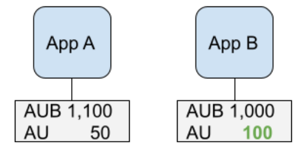
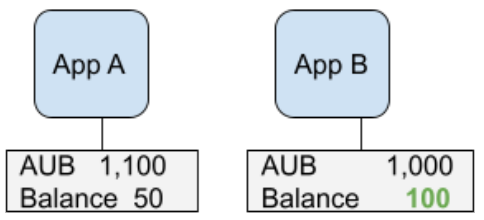
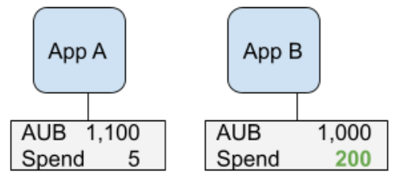
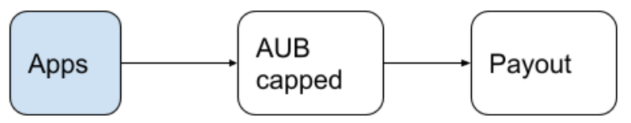
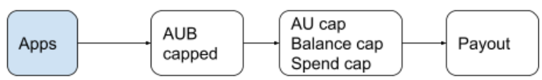
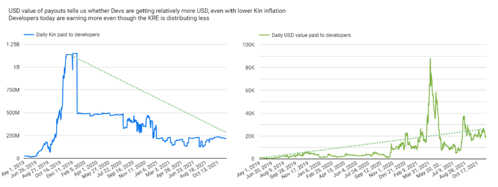

# KRE Improvement Proposal

The purpose of this document is to outline a proposed new version of the
KRE Algorithm to be called KRE 3.1

We have laid a foundation for the reasoning behind the proposed changes
in this [<span class="underline">blog
post</span>](https://kin.org/considerations-in-improvements-to-kre-3-0/).

# Background

The KRE has gone through several changes, and each change has improved
upon its predecessor and also revealed new avenues for refinement. Each
iteration tries to solve for the following:

1.  Incentivize growth of Active Users (economic spread)

2.  Incentivize amount of Kin spent (economic depth)

These two incentives interplay with each other causing growth of the
ecosystem, where more users are:

1.  Holding more Kin (pull Kin from exchanges into apps)

2.  Spending more Kin (growing economic value of Kin)

This proposal aims to continue to drive Kin along this path in a way
that continues to benefit users and developers, while maintaining the
key AUB metric currently used.

## **Abstract**

KRE 3.1 aims to incentivize additional factors to the AUB metric:

1.  Active Users (AU)  
    This is to recognize apps that increase the overall size of Kin’s
    economy. Of two apps with similar AUB, the app with significantly
    higher AU has an additional contribution to Kin’s economy.
    (Economic Breadth).

2.  The size of median balances its users have _relative to other
    apps_  
    Apps with higher median balances are pulling more Kin into the
    economy and have a richer ‘middle class’. While an app with a high
    AUB might only have a handful of users holding a lot of Kin, an
    app with a median balance has a more equitable spread of Kin and
    consequently, more spend opportunities per user.

3.  The size of spends in that app _relative to other apps_  
    While AU increases _Economic Breadth_, an app with larger spends
    increases _Economic Depth_, where the value of goods and services
    being traded are worth more Kin (and indirectly USD).

Additionally, KRE 3.1 also aims to:

1.  Make it possible for users to move between apps and encourage a more open economy.

2.  Lower the barrier to entry for new apps to encourage adoption.

## **Description of Improvements**

### Incentivizing Meaningful Economic Activity

While Active User Balance (AUB) is the primary method to calculate
economic contribution we propose to cap the AUB count for each app based
on that app’s:

1.  Active Users (AU)

2.  The size of median balances its users have _relative to other
    apps_

3.  The size of spends in that app _relative to other apps_

In other words, apps will compete to have higher median user balances
and higher AU and the greater these figures are, the more of the app’s
total AUB will be taken into account for the purposes of calculating
their KRE reward.

At the Kin Foundation, we believe the terminology of the KRE has
historically been too complex. So to simplify how we understand the KRE
calculation today, we are going to refer to these factors together as an
app's **“KRE Score”**. Essentially, apps compete to obtain the highest
KRE Score possible - this is their total eligible AUB to be counted in
the KRE calculation which will be constrained if their number of active
users, median balances or size of in-app spends underperforms in
comparison to their peers.

To illustrate :

Although the interplay between apps in the ecosystem is more dynamic, we
use the following simple examples to highlight the value apps with
bigger spends, better spread of balances and higher AU bring compared to
other apps of similar sizes. In other words, to maximize its reward, an
app will need to improve these three factors to compete with apps on a
similar level, even as it moves up the ranks.

1\. For two apps having similar AUB, but with one contributing more
users into the ecosystem, the app with significantly higher AU gets a
slightly higher reward.

<p align="left">

</p>

Rationale: App B has an additional contribution of users in the economy
and improves Kin’s _economic spread_. Additionally, rewarding apps for
AU also indirectly affects the number of spends to increase.

2\. For two apps having similar AUB, but with one where users have a
higher _median_ balance, the app with a significantly higher balance
gets a slightly higher reward.

<p align="left">

</p>

A sample cross section of these two apps is shown below, where App B’s
users have a bigger ‘middle class’ compared to App A.

| App A | 5   | 5   | 10    | 20  | 800 |
| ----- | --- | --- | ----- | --- | --- |
| App B | 10  | 100 | 100✅ | 100 | 150 |

Rationale: App A and B may have similar AUB. However, app A has many
users with small balances and a few ‘whales’ that push app its AUB
count. App B on the other hand has a higher balance for each of its
users and increases the size of Kin’s _middle class_.

3\. For two apps having similar AUB, but with one where users have a
higher _median_ spend, the app with significantly higher spends gets a
slightly higher reward.

<p align="left">

</p>

A sample cross section of these two apps is shown below, where App B’s
users have a bigger ‘middle class’ compared to App A.

| App A | 5   | 5   | 5     | 50  | 100 |
| ----- | --- | --- | ----- | --- | --- |
| App B | 10  | 200 | 200✅ | 200 | 200 |

Rationale: App A and B may have similar AUB. However, app B has
compelling spends that improves Kin’s _economic depth_.

## **Implementation**

**The Current KRE 3.0**

he KRE 3.0 algorithm is summarized below, where apps are rewarded
based solely on the ranking of each app’s capped AUB. `(AUBapp / AUBTotal)`

<p align="left">

</p>

**The Proposed KRE 3.1**

This proposed KRE 3.1 inserts additional incentives that create a more
competitive environment where apps with higher AU, Balances and Spends
will earn more than apps with a similar AUB.

<p align="left">

</p>

**The Complicated Part**

The KRE algorithm will rank app’s in order of those which have the
highest AUB.

However, similar to today’s algorithm, apps should expect that not all
of their AUB will be taken into account for the purposes of the
calculation. The caps which may apply to an app’s AUB are defined
formally below:

```
AU cap = (AUapp / AUmax ) * AUBcapped

Balance cap = (BalanceApp / BalanceMax ) * AUBcapped

Spend cap = (SpendApp / SpendMax ) * AUBcapped
```

Where:

`AUapp`, `BalanceApp` and `SpendApp` are the Active Users, Median Balance and Median spend of a specific app respectively.

`AUmax`, `BalanceMax` and `SpendMax` are the highest Active Users, highest
Median Balance and highest Median spend attained by apps in that pay
period.

`AUBcapped` is the capped AUB of a specific app `AUBcapped = MIN(100,000 * AU, AUB)`.

While the KRE 3.0 rewarded apps on a ranking of the capped AUB (which is
the lesser of AUB and AU \* 100,000), the proposed update rewards apps
based on their _KRE Score (eligible AUB to be counted)_ , effectively
the lesser of: AU cap, Balance cap and Spend cap.

Formally: `KRE Score = MIN(AU cap, Balance cap, Spend cap)`

Practically, this translates to an app with relatively higher AU,
balances and spends receiving a higher reward than a similar app with
lower values. What this will do is apps will find they need to work on
improving their active user account, median balance and spend
opportunities to optimise their app’s KRE performance.

If, for example, an app has a large AUB but poor spend opportunities
such as 1 Kin spends, then the KRE will take into account the in-app
spends metrics under performing their peers and subsequently, this would
constrain the app’s total eligible AUB. In other words, its KRE Score is
reduced in consideration of the low-value spend opportunities. The app
developer in such circumstances would need to focus on improving the
quality of their spend opportunities in order to ‘break out’ and achieve
a higher KRE Score.

### Advantages:

-   At Day 1 implementation, the current app ranking is not overly
    affected and allows apps to start to adjust over time to improve
    these values. Apps that adapt quickly will find their KRE ranking
    to change positively.

-   Apps that raise the economic value of Kin (volume of spends,
    balances and users) are rewarded more. This will create a more
    competitive environment between apps of a similar size, as in-app
    Kin user activity will be taken into account to determine overall
    KRE ranking between apps.

-   The barrier to entry for new ecosystem apps with high AU but low
    AUB (initially) is reduced. This is because at the outset of a new
    Kin integration with a large consumer app, large numbers of highly
    engaged active users with low balances will provide more
    significant opportunities to take KRE market share away from
    existing apps (friendly competition). This is by altering the
    ecosystem’s AU Max, BalanceMax and SpendMax factors where if they
    outperform existing apps on key metrics their own AUB growth may
    be unconstrained. Each cap can be weighted with a multiplier to
    apply relative importance to each one. We propose the following
    weights: (lower weights increase the strictness of a cap).

    -   AU cap: 0.1

    -   Spend cap: 0.3

    -   Balance cap: 1

The initial cap an app reaches would be AU and finally the Balance
cap. This method allows us to tweak the ‘levers’ of the ecosystem
going forward to draw out the in-app economic behaviour we want to
further incentivize.

## **Changes to facilitate a more open economy**

With the Kin SDKs backup and restore system maturing, users find they
can create an account in one app and restore it in another, or in one
platform (Android) and restore it in another (iOS). As our SDKs continue
to adopt Solana’s wallet format, we see a point in the near future where
users may join Kin’s ecosystem with a wallet they created in a public
wallet such as Phantom or Solflare.

We have also seen NFT applications wanting to participate in the economy
and apps with standard Solana SDKs try to integrate Kin as well.

For Kin’s economy to thrive and gain in value, users need to be able to
migrate and port their wallets in different places, carrying their
balance with them. One app may have great earning opportunities while
another app may have compelling spends.

To enable this, we would like to encourage developers to have open
systems and allow for user movement. If a user has the same wallet in
App A and App B, we propose rewarding each app based on the originating
transaction. If on a particular day, transactions from a shared wallet
came from App A, the rewards would be credited there. If both apps had
transactions on another day, the AU, AUB, etc would be credited to both
apps.

## **Changes to the Monopoly Clause**

The [<span class="underline">monopoly
clause</span>](https://github.com/kinecosystem/rewards-engine/blob/b63e38c3fd0eb110f58c85340bd561ee8593af12/current-KRE.md#monopoly-clause)
exists to ensure a variety of app sizes are able to coexist and increase
Kin’s value through cooperative competition. To encourage very small
apps to participate and compete on their level, we propose adding a
minor curve to the payout, evening out the tail end of KRE rewards for
small apps with \20 AU.

The curve formula proposed for an app i is: `(2,999 * Payout_i / 3,000) + (MAX(Payout) * (1 / 3,000))`

Practically, this results in small apps getting an extra \~ 50K Kin as
they start to experiment with rewards. This number would change based on
total apps in the ecosystem.

## **Impact of Transitioning to KRE 3.1**

We have taken care to balance these proposals against the position
current ecosystem apps have earned themselves in the ecosystem today
while looking forward to the further development of in-app economies we
want to incentivize.

The table below shows a simulation of expected changes in the balance of
rewards for apps on the KRE algorithm run on a typical payout date. The
median balances and spends are actual values.

Three middle sized apps with the lowest median spends have seen a
decrease in Kin distribution that has moved to apps with larger spends.

| **App** |  **AU** | **Capped AUB** | **Median Balance** | **Median Spend** | **KRE 3.1 Payout** |     **Change** |
| ------- | ------: | -------------: | -----------------: | ---------------: | -----------------: | -------------: |
| 1       | 196,798 | 18,457,217,255 |                402 |           24,719 |        148,449,999 |   \+28,557,770 |
| 2       |  60,568 |  6,056,800,000 |             19,935 |            3,748 |         69,842,377 |   \+30,499,325 |
| 3       |  40,116 |  2,282,889,498 |              5,241 |            5,745 |         30,666,297 |   \+15,837,370 |
| 4       |  13,338 |     10,216,976 |              1,819 |               24 |            194,944 |      \+128,578 |
| 5       |  79,754 |  7,975,400,000 |                601 |                3 |            158,206 | 🔻\-51,647,463 |
| 6       |   1,869 |    186,900,000 |              1,988 |            2,055 |            115,941 |    \-1,098,102 |
| 7       |  26,005 |  1,646,690,009 |             19,730 |                1 |             61,300 | 🔻\-10,635,076 |
| 8       |   1,820 |     25,395,773 |                111 |               11 |             58,167 |      \-106,796 |
| 9       |  18,107 |  1,810,700,000 |                298 |                1 |             55,982 | 🔻\-11,705,750 |
| 10      |     205 |     20,500,000 |                 67 |              828 |             50,283 |       \-82,879 |
| 11      |      56 |      5,600,000 |              1,800 |            1,228 |             49,543 |       \+13,167 |
| 12      |      42 |      4,200,000 |                228 |               34 |             49,517 |       \+22,235 |
| 13      |      36 |      3,000,723 |             13,743 |              677 |             49,508 |       \+30,016 |
| 14      |      12 |      1,200,000 |              1,024 |            1,500 |             49,486 |       \+41,691 |
| 15      |       2 |        200,000 |                  1 |            3,200 |             49,483 |       \+48,184 |
| 16      |       1 |        100,000 |         48,118,139 |          538,176 |             49,483 |       \+48,834 |
| 17      |       1 |         90,492 |             10,000 |                1 |             49,483 |       \+48,896 |

While most apps have had some increases in Kin disbursed, some (apps 5,
7 and 9) have had a significant reduction. (Up to 50 MM Kin). This is
because they have relatively low median spends compared to their peers,
even though they have a high AUB. In order to improve rank, they would
need to improve the size of spends in their apps. There will be ample
time for apps to adjust and monitor their stats before the KRE 3.1 rewards
are switched on.

**<span class="underline">We propose to have the KRE 3.1 algorithm be
active on and from April 1, 2022</span>**. During the transition period,
we recommend apps to begin to adjust the size of spends and balances
held by their end-users.

## **Inflation 2022 - Changes to the Daily Payout**

We have seen the value of Kin correlate to the amount of Kin inflated by
the KRE. The USD value of Kin paid out to developers has continued to
rise with a continued decrease of KRE inflation. To continue with this
trend, **<span class="underline">we recommend reducing the daily payout
rate from 250MM Kin to 220MM KIN beginning June 1st, 2022</span>**. We
invite all ecosystem stakeholders to comment and/or make separate
proposals on the appropriateness of the proposed daily payout rate.

<p align="left">

</p>

## **Discussion**

This proposal updates the reward formula from a ranking based on the
capped AUB, to the formula: KRE Score = MIN(AU cap, Balance cap, Spend
cap)

It adds a new dynamic where the relative size of an apps’ AU, Balances
and Spends becomes part of the criteria that affects rewards. Over time,
we expect to see apps continue to innovate in these areas as a result.

To kickstart larger spends, we will start counting only transactions >= 1,000 KIN for KRE rewards on April 1st. In other words, transactions smaller than 1,000 KIN will not be counted towards the KRE. Eventually, we may reduce this limit as a deflationary adjustment.

As apps begin to work on balances and spends, the amount of Kin flowing
into the ecosystem from exchanges is expected to increase. The growth of
Kin’s economy in terms of users, spends and balances creates a pull in
the markets and increases the scarcity of Kin. Over time, we expect Kin
to trend toward a deflationary phase, where less Kin is disbursed by the
KRE than is consumed/ burned by the economy. At this point in time, the
Kin used by apps to feed their individual economies will need to come
from buy modules.

Please post any discussions related to this proposal
[<span class="underline">here</span>](https://github.com/kinecosystem/rewards-engine/discussions).
