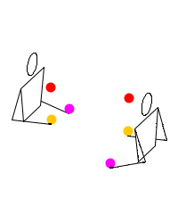
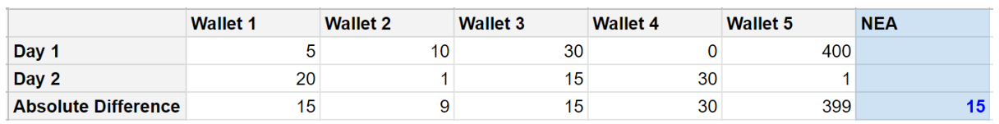
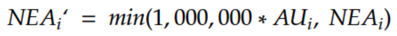

#
# **KRE Improvement Proposal**

The purpose of this document is to propose updates to the methodology and rules used for the Kin Rewards Engine.

_versioning:_

- KRE 4.0

## **Proposed by:**

William Gikandi

## **Abstract:**

This proposal aims to reward apps for generating high economic activity with Kin. Specifically, the proposal rewards apps that demonstrate:

1. Higher Active Users (AU)
2. Higher Balances in wallets
3. Higher spends

This is while maintaining the benefits of the [KRE 3.0](https://github.com/kin-labs/rewards-engine/blob/master/accepted/kik_kre_3_0.md) and also improving on top of its weaknesses.

## **Introduction:**

The KRE 3.0 has been successful successful in what it set out to do, namely:

1. Encourage the flow of Kin from outside the ecosystem into users' wallets
2. Encourage economic activity between users from spending that Kin.

It did this by rewarding for Active User Balances (AUB), a proxy for wallet balances and spend frequency of an app's users.

During the years of implementation, we have seen more Kin flow into the economy than in previous iterations while economic activity was maintained. It also closed off many gaming avenues that were present in previous versions of the KRE. However, the KRE 3.0 also had the following issues:

1. Although AUB encouraged economic breadth (number of users spending), it failed to adequately encourage depth (size of spends)
2. AUB could be gamed by an app introducing a handful of large wallets while most of its economy was poor. This can be likened to rewarding for an economy with an elite rich with a majority populace under the poverty line
3. Inflation was only managed in the short term, through the [volatility adjustment cap](https://github.com/kin-labs/rewards-engine/blob/d9a4d3282b6e80b03b9376fc9dfb5694a3f0aac8/accepted/kik_kre_3_0_cap.md).
4. The depth of integration of Kin was not encouraged or rewarded for. Some apps had deep Kin integration while others only had marginal integration

In order to have truly healthy economies, users need to become better spenders in terms of frequency and size.

Additionally, the KRE should have some means of managing and curbing inflation in the long term.

# KRE Logic Update:

**Addressing Economic Wealth (balances) Depth (spend sizes) and Breadth (spend frequencies)**

In order to address these concerns while maintaining the benefit of AUB, we introduce the concept of Net Economic Activity.

### **Net Economic Activity (NEA)**

Consider two users: Bob and Alice who each have 5 KIN in their wallets. If they juggle this Kin between them 100 times in a day, the total GDP for that day is 500 KIN. However, nothing has really happened and it's just two accounts sending Kin between each other. Dishonest apps in the past have used this as a gaming avenue.

One way to close this gaming vector is by looking at the balances in Alice and Bob's wallets at the end of the day. If, at the end of the day, all they did was juggle Kin between them and the balances remain the same, nothing really happened. If they still each have 5 Kin, their Net Economic Activity is effectively 0.

However, for an app that has genuine economic activity, the balances of each wallet change on a daily basis, just like in real life. An app with high Net Economic Activity is one where genuine transactions have happened during the day.

In addition, Net Economic Activity has _interesting hidden properties_ we examine below.

## Hidden Properties of Net Economic Activity

Net Economic Activity is the median of absolute differences of balances in an app in a day. Let us simplify this formal statement with an example:

In the table below, Net Economic Activity of a hypothetical app totals to 15.

To calculate the NEA for an app, we:

1. Get the differences in the balances of each wallet for the last 24 hours. (Absolute difference)
2. Get their median

E.g.

The median of 15, 9, 15, 30, 399 is: 9, 15, \*\*15\*\*, 30, 399. In other words, the NEA for this sample app = 15. The median user is spending 15 KIN on a daily basis.

### How to maximize earnings as an app

In order for an app to win, they will need to maximize their Net Economic Activity (NEA). To do this, they need to:

1. Give Alice & Bob very high balances (solves for Median Balance & AUB)
2. With high balances, get them to spend as much as possible (solves for Median Spends)
3. With high spends, get them to spend as often as possible (solves for economic activity)

_Reasoning_

1. An app with low balances can only get users to spend tiny amounts. E.g. 5 Kin.
2. An app with high balances can get users to spend millions of Kin each day
3. To have a daily high NEA, the app needs to get each user to spend as much as possible on a daily basis

This allows us to encourage a vibrant economy in apps, while keeping things simple. The KRE equation now becomes:

Where the numerator (top) is the NEA of the app multiplied by its AU. The denominator is the sum of other apps' NEA & AU. This equation is simple, includes all of our factors and is difficult to game.

Additionally, apps will compete by trying to keep balances and spends as high as possible, without needing constraints that require a minimum spend amount.

### NEA Cap

One gaming avenue exists where an app with very few users can distribute large balances to each user and have a high median spend. This avenue is closed by capping the NEA in a similar way to the AUB cap, where an app's NEA is capped by:

 

Where an app's effective NEA is capped by the total active users it has.

Note that with the application of NEA, the AUB (if measured) may show an initial drop. This is because the NEA does not simply encourage 'stagnant kin' sitting in apps. An app is incentivized to grow user app balances as long as users are spending amongst themselves.

In simple terms, an app has no incentive to get its users to hold 1B Kin each, if items and spend opportunities in the app amount to 1K being spent per user per week.

## Net Economic Activity as a proxy for GDP

Net Economic Activity shows us how much the median users are spending and earning in an app. Multiplied by the Active Users, this gives us an approximation of the true GDP (economic activity) - after filtering out gaming vectors.

In a nutshell, what we have done here is:

1. Create a strong definition of economic activity (NEA)
2. Multiply it with Active Users to get the true GDP of the app
3. Reward the app in proportion to how much it contributes to the overall GDP

### Adjusting the daily reward cap

The daily reward for Kin should be reduced by 10% from 250,000,000 KIN to 225,000,000 KIN. This ensures a gradual reduction of supply with time, making Kin more scarce. This also ensures continuous supply of Kin for a very long time - where the quantity of Kin disbursed by the KRE reduces, but the dollar value remains equal or increases with time.

## **Implementation**

**Net Economic Activity**

1. The Net Economic Activity of current apps should be measured and displayed for apps to be able to track and improve on their current status before being implemented. (3 months)
2. During this period, adjustments can be made to the NEA cap to make sure that it is reasonably applied to apps
3. An assessment can also be made of the current standings, to determine adjustments to the Monopoly Clause and to ensure that rewards are fair for all app sizes
4. Critically, these factors also need to be measured to ensure the economy maintains a healthy state:
    - User Median Spends
    - User Median Balances
5. At the end of the 3 months, the algorithm should be applied in full

**Daily reward cap**

1. The new inflation rate should begin with the implementation of the NEA

# Addendums
1. [Managing Inflation](/improvement-proposals/wg_kre_inflation.md)
2. [Lending/ Issuing Bonds](/improvement-proposals/wg_kre_lending.md)
3. [Integration Depth](/improvement-proposals/wg_kre_kin_integration.md)