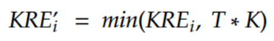

# Addressing and Curbing Inflation over the long term
Addendum to [NEA KRE 4 Proposal](/improvement-proposals/wg_kre_4.0.md)

Over the long term, the amount of Kin entering circulation through the KRE should move from:

1. Positive inflation: The KRE is used to kick-start the economy and encourage apps to join the ecosystem. As apps enter the ecosystem and introduce users to Kin, users should also start to purchase Kin from the markets.
2. Neutral inflation: The amount of Kin bought by users an pulled into the economy is roughly equal to the amount disbursed by the KRE
3. Negative inflation: The amount of Kin bought by users exceeds the KRE distribution

Some attempts have been made to reduce inflation by including the volatility factor. Although this does work during short periods of time (months), the overall inflation of Kin has remained positive.

There are several ways of addressing this:

1. **Waiting** : Wait for the economy to grow in size while slowly constricting the amount disbursed by the KRE over time.
 The disadvantage of this is the amount of time it would take is indefinite, and doesn't incentivize innovating towards buy use-cases for Kin.
2. **Reducing the KRE** : Reduce the rewards amount to match the total amount of Kin being bought in the ecosystem.
 This has the disadvantage of being too quick for apps to be able to adapt. It is also a blanket application that does not reward apps that encourage the demand of Kin over others that are slower to do so.
3. **Capping:** Create a per-app rewards cap, based on the amount of Kin its users bought that month.
 This has the advantage of:
  1. Being app specific
  2. The cap can be tightened slowly over 3 years, until Kin becomes deflationary

The capping formula is defined as follows:

Where:

KRE' is the inflation adjusted KRE reward for a specific app.

KRE is the non adjusted reward for a specific app
 T is a "cap factor"

K is the total Kin an app has bought from the markets

Initially, T can be set to match the KRE's daily inflation rate. This means that if an app buys at least 1 KIN from the market in that payout period, the app would get its full reward.

However, T should be brought down over time so that it becomes \< 1. At this point, _Kin becomes a deflationary currency_. In simple terms, if T was 0.9 and an app bought 100 KIN from the market, the max the KRE could disburse to that app would be 90 KIN.

It is important that the Kin Foundation manages T and works with apps to bring it down, including encouraging taking on profitable strategies that are compatible with T. These have been highlighted in a [previous article](https://will-gikandi.medium.com/the-3-stages-of-kins-ecosystem-3ff2b6a75a9d).

For example, the foundation could work with apps to reduce the value of T over 3 years through 3 stages of inflation:

1. Inflationary (current)
2. Neutral
3. Deflationary

Once Kin approaches neutral and deflationary states, and also starts to embody virtuous cycles where apps and users naturally want to hold Kin for speculative purposes.

## **Implementation**
Consensus should be reached with apps, so that they can understand how T would take effect over time, including the challenges and opportunites it presents
